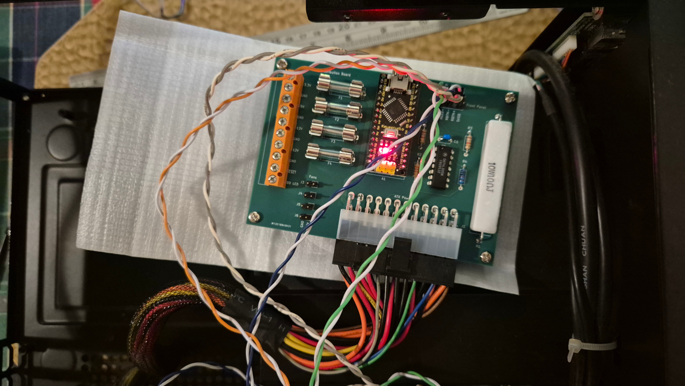

ATX Power Distribution Board
============================

This repository contains a design for an adapter board that connects
to a standard 24-pin ATX power supply connector and makes the
voltage rails available for homebrew computer use.

The board is designed to be retrofitted into an ITX computer case,
with the ITX power button, power LED, hdd LED, and reset button
connected to the board to provide power on/off control.

* [Schematic](schematics/ATX-Power-Distribution-Board/PDF/ATX-Power-Distribution-Board.pdf)

## License

Distributed under the terms of the MIT license.

## Contact

For more information on this code, to report bugs, or to suggest
improvements, please contact the author Rhys Weatherley via
[email](mailto:rhys.weatherley@gmail.com).
